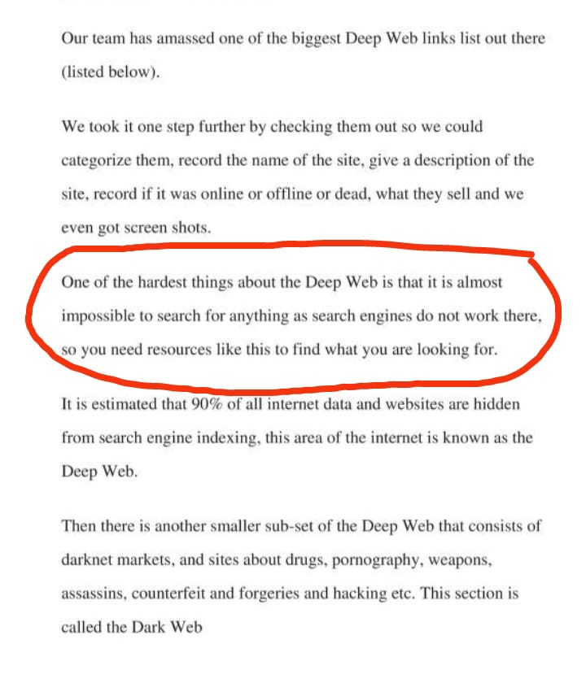
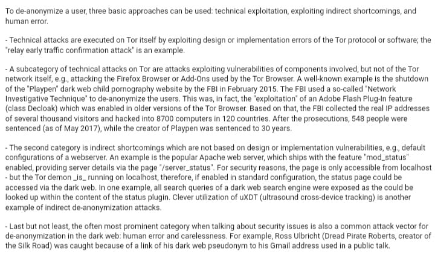
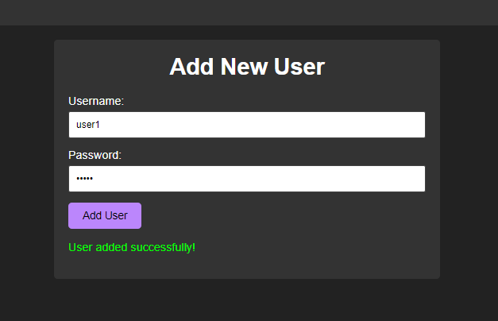
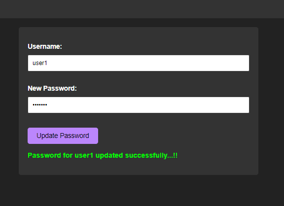
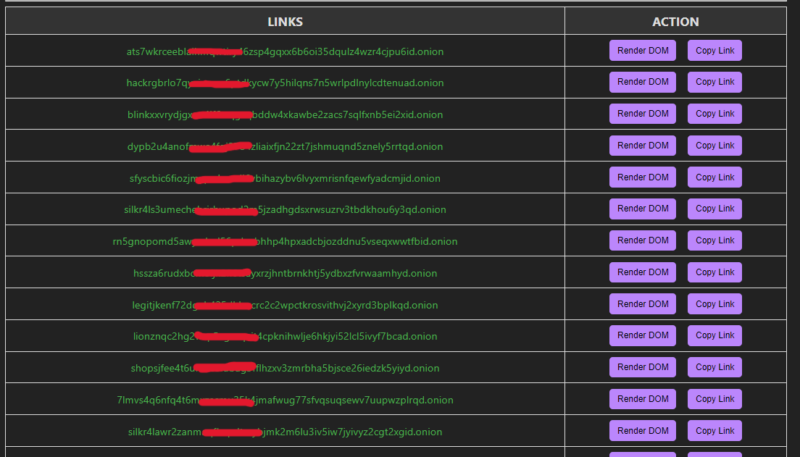
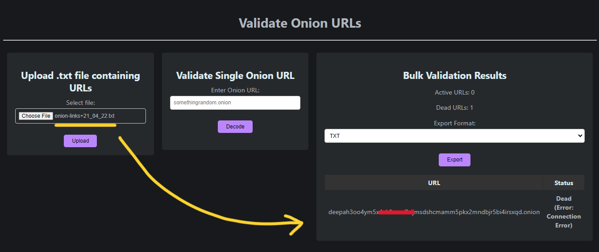
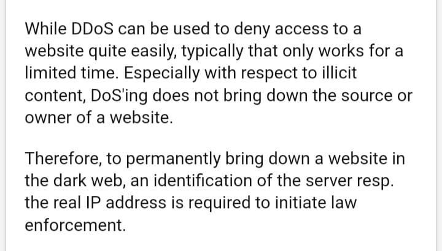
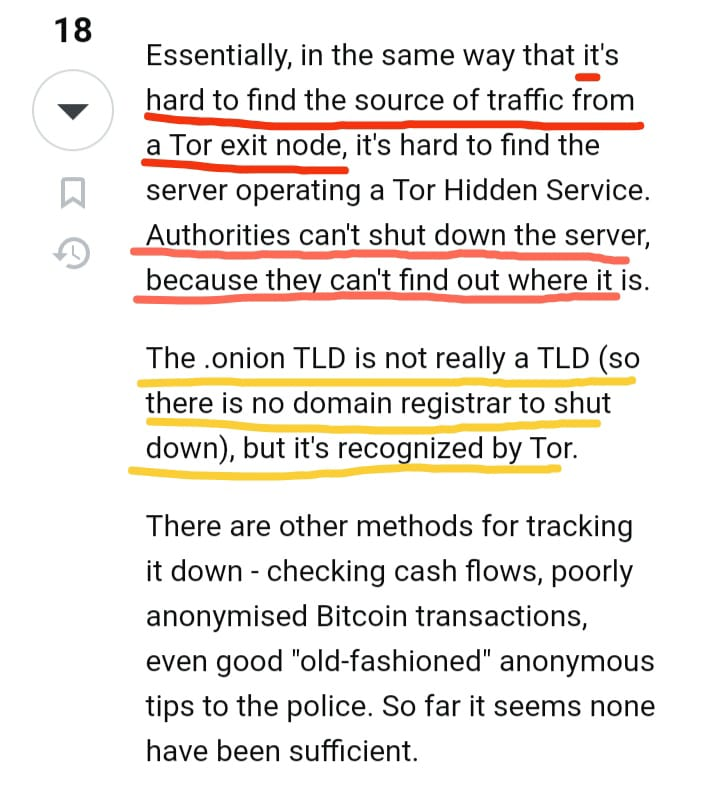
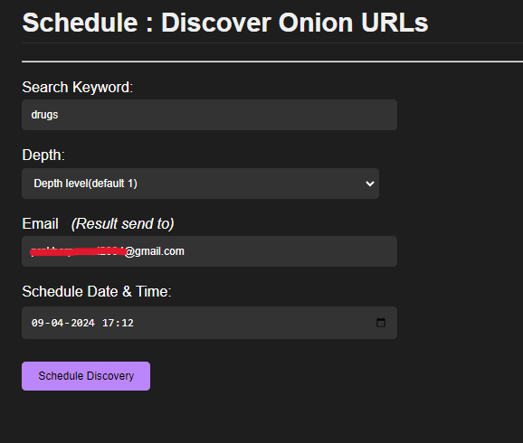

# INTRODUCTION

Welcome to the documentation for our innovative software solution **TORNET GRANTED** _aimed at efficiently enumerating URLs of active hidden servers over anonymous channels, particularly within the TOR (The Onion Router) network._ *Developed in response to PSID-1455 from the Smart India Hackathon 2023*, our software represents a significant advancement in cybersecurity & Threat Intelligence.

**Problem Statement Overview**

The Onion Routing (TOR) network serves as an overlay anonymous network over the internet, providing both anonymity for clients accessing the network and a platform for hosting servers anonymously. However, this anonymity has been exploited by malicious actors, necessitating the development of tools to identify and enumerate active hidden servers hosting potentially harmful content or engaging in illicit activities.




**Our Solution**

Our software solution is a Proof of Concept (PoC) designed to efficiently enumerate URLs (.onion) of active hidden servers hosted over TOR. By examining the cryptographic security controls and search engines scraping techniques, our software provides a robust means of identifying and cataloging active hidden services.

# INSTALLATION

### For Linux
```
git clone https://github.com/darshanPC25/TornetGranted.git
cd TornetGranted
pip install -r requirements.txt
apt install tor
apt install exiftool
```
```
service tor start
```
or
```
systemctl start tor
```
-----
### For Windows
```
git clone https://github.com/darshanPC25/TornetGranted.git
cd TornetGranted
pip install -r requirements.txt
```
**Download the latest version of TOR & EXIFtool**
```
https://www.torproject.org/download/tor/
https://github.com/exiftool/exiftool.git
```
---------------------------------------------------

# OVERVIEW

## Authentication
-  So firstly we have the login page in the web application *where you can login but not signup*, to get authorized use **you have to contact your admin to add you as a user** (since the project is related to the dark web, TOR and threat Intell, we prefer authorized use of it.) BTW, there is a **default admin user**, when downloading the software. creds (`admin:admin`)

- Once you have an authorized account, now you can use it, so you have 5 functionalities over there 
  -    Discover Onion URLs 
  -    Validate Onion URLs 
  -    Render DOM of the Onion URLs 
  -    Enumerate Onion URLs 
  -    Schedule Tasks 


## 1- Discover onion URLs 
 - our software provides the functionality to discover URLs based on `keywords` and `level` (recursive), so the user needs to provide a keyword and level of recursion(how deep you want to go) to discover the onion address related to a provided keyword. Additionally, once you have the result (discovered URLs), export the result of all the discovered URLs and you can render the DOM of any discovered URL.


## 2 - Validating Onion urls
 - Sometimes, we have valid onion addresses (URLs) but they are not alive, hence to validate whether the onion URLs are alive or dead, we provide this functionality where users can check the status of those onion URLs and they have basic two options either validate a single URL or validate bulk URL(by uploading `.txt containing a list of URLs`), and export the result.

## 3 - Extract DOM of Onion urls
 - In this section, we have the functionality to render the DOM (source of the page) of any provided onion URL (address).

## 4 - Enumerate Onion URLs
 -  In this section, we enumerate the most basic info, leaks about the provided onion address, if we talk about the leaks, we use basic regex techniques to discover `username, passwords, crypto address, domain names, and more`,
   


 - Honestly, there is no such direct technical way of finding the real IP or location of the hidden server hosted over the TOR.
 - Additionally, there is another functionality in the same section to see the EXIF metadata of the images and other media files, to analyze any hidden messages.
 
 ## 5 - Schedule Tasks
  - In which you can schedule tasks for future date/time, once the task is completed on the given date and time, it will send the result through the SMTP email to the user email. currently, I put `only discover onion address` functionality in the scheduling tasks, but in the future, I may add more to it(or you can also contribute).
   
 ### These are the major functionalities in the software(for all users), now we'll look into the admin user functionality also.
  - 1 - Admin can see all users details, like username, password(SHA-256 encrypted), API key, secret-access key,
  - 2 - Admin can delete any user 
  - 3 - The admin can update any user password 
  - 4 - Admin can add any users
  - Default creds -> `admin:admin`

------------------------------------------------------------

# CORE CONCEPTS

## Tech-Stack
 - Python Programming Language
 - HTML, CSS
 - SQLite 3
 - Flask
 - Exif tools
 - TOR Daemon

## Authentication and Authorization
 - Since you cannot register yourself on the software, you have to request admin to authorize you.
 - There is a default user when downloading the software, which is `admin`, you can log in to the admin account by providing credentials as `admin:admin`
 - Only the `admin user can access the admin portal`, no other user can access it.
 ```
@app.route('/users', methods=['GET'])
@login_required
def users():
    if request.method == 'GET' and current_user.username == 'admin':
        users = User.query.all()
        return render_template('users.html', users=users)
    else:
        return redirect(url_for('unauthorize'))
 ```

 - Yes, the code isn't secure, since the validation is only done by username.
 ---
 ## 1 - Admin Portal
  - 1 - Admin can see all the user's details.


  - The reason behind using `API_KEY` & `SECRET_ACCESS_KEY` is that initially, we thought of making `CLI(Command Line Interface)` for it, but due to a shortage of time & people, I prefer to let it be on GUI only.

  - 2 - Admin can add any new user.



  - 3 - Admin can update any user password.



  - 4 - Admin can delete any user.
---
## 2 - Discover Onion URLs


 - So, if you don't know the context of Discover Onion URLs, please read more about it in the overview section.
 - In this section, we have to find as many as possible no. of `unique onion URLs` related to any particular `keyword`. So for that, I chose to scrape the popular dark web search engines.
 - Firstly you need to provide the keyword for which you want onion URLs, then choose the depth level, and click `Discover Onion Links`
 **` Note: We made this as fast as possible, The higher the value of the Depth level  you choose  the longer time it will take to process`**
  - The time delay, also depends upon your internet connection, ISP configuration, and system configuration.
 - It will display the results to you as
 - You can export the result in txt, JSON & pdf format.



 ---
## 3 - Validate Onion URLs


 - In this section, you can validate the onion URLs whether they are alive or dead
 - In the `Bulk Validation` make sure you provide the **`.txt`** only.



---
## 4 - Extract DOM of Onion URL


- In this section, you just need to provide the Onion address and you'll get the DOM of that URL

---
## 5 - Enumerate Onion URLs


 - Since the project is made for researchers, security folks, and intelligence agencies, So I researched how some of the popular dark website owners get caught and got to know that, they all got busted by basic site configuration mistakes, either they leak their email, or any default server configuration file leaking which expose their geolocation. (eg. SilkRoad)
 - Hence, I  want something related to it in my project, adding some basic enumeration techniques using regex, which looks for `usernames, passwords, crypto address, domain names, most common server configuration files, etc.`
 - You will have another checkbox in it i..e `FUZZ`, the basic idea of adding this is because sometimes, the dark web site owners expose their server configuration file, which leads to exposing their geolocation or any info that could potentially expose them. `Fuzz` enables you to check for these server configuration files.



  **Note: If you're thinking about why I am so selective in it, these are the screenshots I've taken through the research.**




  
  - Additionally, there is another functionality to see the EXIF metadata of the media files like images, videos, etc. Again think of adding this feature when researching about `ICR(Internet Chat Relay)` or `chat rooms in DarkWeb` in general, I know that most adversaries, and terrorist organizations usually `communicate with each other by hiding their messages in these media files(steganography) and sending each other over these chatrooms.`


  
---
## 6 - Schedule Tasks



 - when researching about this dark web, I got to know that some of the site owners active their servers at very specific times, additionally to give users some easy handy automation, I added this functionality where users can schedule tasks by providing the necessary details and date/time of that task.
 - Once the given task is completed, the results are sent to you over your email.


 - Currently, I added `Discover Onion URLs` only, since this functionality is pretty much out of the context of the software, hence If users want me to add other functionalities to it,  I will surely add others (or you can contribute to it).
 
**`Note: Make sure you've set your email(Gmail) and Gmail APP password key in the config.txt file for successful task notification over email`**

 - [Create Gmail APP Password](https://support.google.com/accounts/answer/185833)


   
-------

# CONTRIBUTION

We welcome contributions from the community to enhance and improve our project. Whether you're interested in adding new features, fixing bugs, or improving documentation, there are many ways to contribute and make a difference. Here's how you can get involved:

1.  **Code Contributions:**
    
    -   If you're a developer, you can contribute code to our project by addressing open issues or implementing new features.
    -   Fork the repository, create a new branch for your changes, and submit a pull request (PR) with your proposed changes.
    -   Ensure that your code follows our coding standards and conventions, and include relevant tests to validate your changes.
2.  **Bug Reports:**
    
    -   If you encounter any bugs or issues while using our project, please report them on our issue tracker.
    -   Provide detailed information about the bug, including steps to reproduce it and any relevant error messages or logs.
    -   Your feedback helps us identify and fix issues, improving the overall quality and reliability of the project.
3.  **Documentation:**
    
    -   Clear and comprehensive documentation is essential for helping users understand and use our project effectively.
    -   You can contribute to our documentation by fixing typos, clarifying unclear instructions, or adding new sections as needed.
    -   Submit a PR with your proposed changes to the documentation repository, ensuring that your additions are well-written and easy to understand.
4.  **Testing and Feedback:**
    
    -   Testing is crucial for ensuring the reliability and stability of our project.
    -   Help us test new features and changes by downloading the latest version of the software and providing feedback on your experience.
    -   Report any issues or unexpected behavior you encounter during testing, and let us know how we can improve.

# RESOURCES
 - [USING PYTHON TO MONITOR DARKWEB](https://www.digitalforensicstips.com/2023/01/using-python-to-monitor-onion-dark-web.html)
 - [DARKWEB SCRAPING USING PYTHON](https://hoxframework.com.hr/?p=473)
 - [IS TOR STILL ANONYMOUS](https://youtu.be/-uDYvy2jQzM?si=UrVGUBlkLLikg9VP)
 - [EDWARD SNOWDEN RESEARCH](https://www.theguardian.com/world/interactive/2013/oct/04/tor-stinks-nsa-presentation-document)
 - [DEFCON-22 : HOW PEOPLE GOT CAUGHT](https://youtu.be/eQ2OZKitRwc?si=P1gPeP9lVDg9g6Fs)
 - [DEFCON-22 : Touring the Darkside of the Internet](https://youtu.be/To5yarfAg_E?si=Ek9lqNOYeLy-cCbb)
 - [Bad OPSEC : HOW TOR USERS GOT CAUGHT](https://youtu.be/GR_U0G-QGA0?si=UaX2Fp_vW1faqTrl)
 - [Deanonymization of TOR HTTP Hidden Services](https://www.youtube.com/watch?v=v45_tkKCJ54)
 - [Uncovering Tor Hidden Service with Etag](https://sh1ttykids.medium.com/new-techniques-uncovering-tor-hidden-service-with-etag-5249044a0e9d)
and more...
